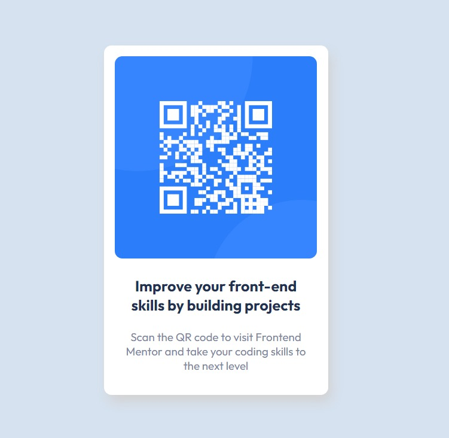

# Frontend Mentor - QR code component solution

This is a solution to the [QR code component challenge on Frontend Mentor](https://www.frontendmentor.io/challenges/qr-code-component-iux_sIO_H). Frontend Mentor challenges help you improve your coding skills by building realistic projects. 

## Overview

### Screenshot

### Links

- Live URL: [Codepen](https://codepen.io/anterojunior/full/ZEoObXe)

## My process

### Built with

- HTML5
- CSS3 (Flexbox and Media Queries)
- SCSS (Sass)

### What I learned

- [x] Remembered how to use @media
- [x] Learned how to use Sass to save time during my development
- [x] Remembered how to align items using flexbox
- [x] Google Fonts